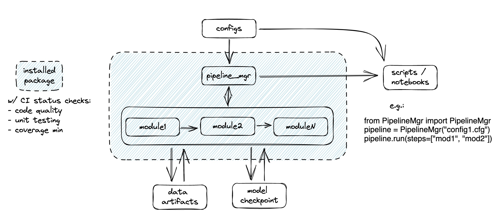

# ds-ml-template

An opinionated template repo for data science / ML pipelines in python

## Philosophy && Practice
- Modularity
  - Separate directories for data, notebooks, base package, and tests.
  - Different *workflow components* are separated from each other and from *workflow management* (i.e. `Pipeline`), to allow flexible recomposition.
  - Configurations are further separated via config files.
- Readability
  - Pipeline manager enables low-code notebooks designed for *data exploration* and *workflow management*.
  - Code formatting / linting / testing is enforced
  - Docstrings and type-hinting in function definitions
- Repeatability
  - Dependencies / environment managed through code (i.e. `setup.sh`), including installation of the base package.
  - Workflows instantiated through low-code scripts or notebooks, which could further be managed by a dedicated WMS.
- Robustness
  - Unit tests and code coverage requirements strictly enforced through
    - pre-commit hooks
    - CI pipeline through github actions
    - branch management.

## Summary diagram
